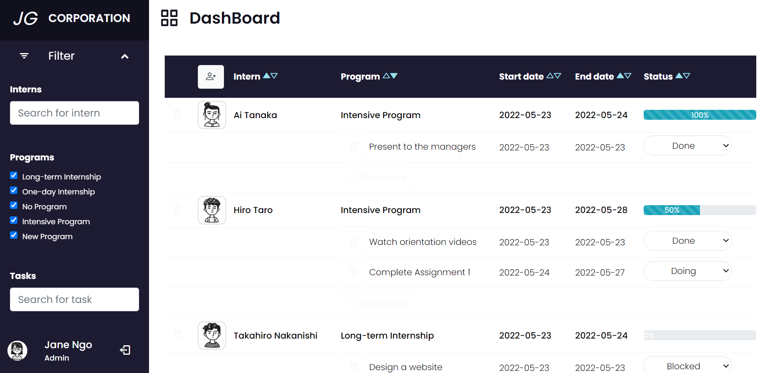
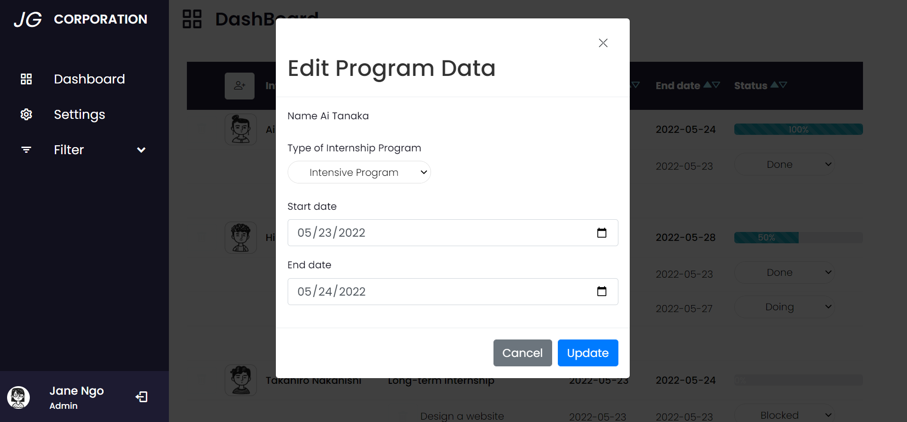
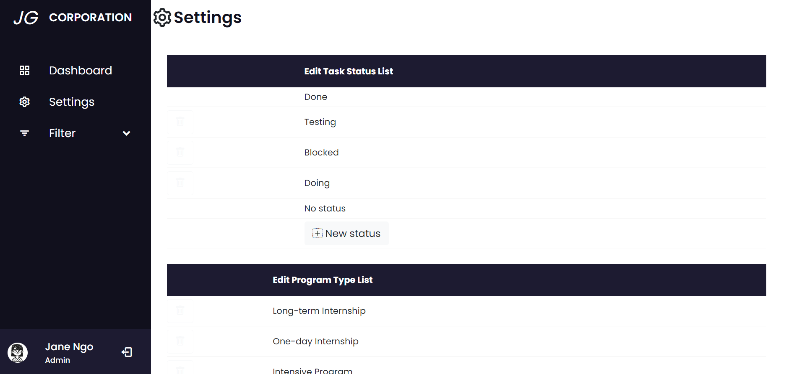

# Project Intern Management System using PHP/MySQL
 
## About This Project
The Intern Management System using PHP and MySQL can help a particular company manage the progress of their interns. The system has two system users: the Admin, and the Intern.

Admin users can have a full control over the system. They have access to the whole list of interns. They will create a new user/intern, assign programs and tasks as well as their due dates and status. Admin users can also add, edit, or delete this information. Moreover, they can also modify the program list or status list. Intern users can only have access to their own data. They can edit their tasks' status, and personal information. Both Admin and Intern can use the filter and sort functions.

## Features of Intern Management System
* Login Page
* Dashboard
* Programs (CRUD Features)
* Tasks (CRUD Features)
* Program Progress Bar
* User (CRUD Features)
* Admin Settings
* Filtering
* Sorting
and Many More..

## Screenshots
 
*Login Page*

*Filtering and Sorting functions*

 
*Add-Edit-Read-Delete using Bootsrap Modals*

 
*Admin Settings Page*